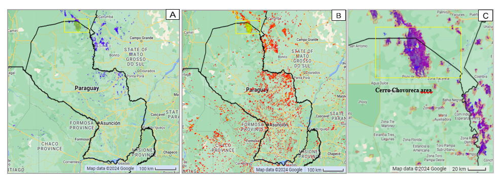

Analysis of the 2019 Cerro Chovoreca Fire in Paraguay
================
Gisela Noguera Toffoletti
2024-11-08

## Abstract

This chapter analyzes the 2019 fire in Cerro Chovoreca, a protected
wildlife area in Paraguay. The fire, one of the most impactful according
to the National Emergency Secretariat (2019), lasted for approximately 7
days in the study area, from September 15th to September 21st. It
affected 293,000 hectares across 12 of 17 departments, and it involved
over 900 people in controlling the fire. The objective of this analysis
is to address the following questions: Is there a relationship between
the precipitation patterns in the Northern area of Paraguay and a
possible recurrence of fire in this region? Is it reliable to use the
Visible Infrared Imaging Radiometer Suite 375mm (VIIRS) to monitor
active fires? Is there a correlation between the burned area identified
by thermal sensors and the areal extent of Normalized Difference
Vegetation Index (NDVI)? What is the reliability of the thermal sensors
compared to NDVI in assessing the extension of burned areas? To address
these aspects, we will use specific remote sensing data, including
Tropical Rainfall Measuring Mission (TRMM/3B43V7) to calculate
precipitation anomalies, Fire Climate Change Initiative (Fire_cci) and
Visible Infrared Imaging Radiometer Suite (VIIRS) 375mm sensor to
identify burned areas. The NDVI will be computed using the MOD13A2.061
product. The results obtained show that the precipitation anomaly
analysis presented a decrease before the fire season. In 2019, a decline
was observed that was not markedly different from those seen in the
years preceding 2015. Utilizing VIIRS 500m data, we identify more hot
spots in Northern Paraguay, but it doesn’t confirm active fires. The
product Fire_cci, with 250m resolution, did not detect small fires or
probably false positives, given the information regarding higher areas
of fires. Furthermore, NDVI anomaly analysis demonstrates post-fire
vegetation decline in 2019, followed by recovery until 2022.

## Introduction

In 2019, Paraguay’s fire season impacted 12 out of 17 departments,
including the capital, affecting 30 districts and 12 indigenous
communities. According to the National Emergency Secretariat (2019),
there was a significant increase in hotspots during August, reaching
26,456, compared to an average of around 20,000 detected in the years
2008-2018. These hotspots were identified using the Visible Infrared
Imaging Radiometer Suite (VIIRS), which operates with two sets of
multispectral channels providing global coverage at resolutions of 375m
and 750m, updated every 12 hours (Schroeder et al., 2013).

The northeastern region of Alto Paraguay, particularly Bahía Negra and
Cerro Chovoreca, experienced severe effects, with 293,000 hectares of
forest and grassland impacted. Cerro Chovoreca, a Protected Wildlife
Area since 1998, spans 100,953 hectares (Ministerio de Cultura y
Ganadería, 1998). This study aims to analyze the 2019 fire event using
satellite imagery to assess the relationship between precipitation
patterns and fire recurrence, as well as the influence of agricultural
expansion in the Paraguayan Chaco. Intense deforestation due to
mechanized agriculture has increased vegetation vulnerability, leading
to higher fire frequency and reduced resilience (Mereles & Rodas, 2014).

Additionally, the study evaluates the accuracy of VIIRS in monitoring
active fires compared to the Fire Climate Change Initiative (Fire_cci)
product, which provides burned area data. Mereles & Rodas (2014) note
that high solar reflection can cause false alarms in daytime VIIRS data.
The research will also measure the Normalized Difference Vegetation
Index (NDVI) anomalies to correlate burned areas identified by thermal
sensors with NDVI extent. This analysis is crucial for assessing
vegetation conditions before and after fire events, as NDVI can indicate
higher fire probability and monitor post-fire recovery, highlighting the
importance of satellite time series for accurate burned area
classification.

Data per region of burned areas in Paraguay in 2019, base on the Global
Wildfire Information System (GWIS).

| Region           | Burned Area Km2 | Nr. of Fires |
|------------------|-----------------|--------------|
| Alto Paraguay    | 4.484           | 0.02         |
| Alto Paraná      | 1.827           | 0.026        |
| Amambay          | 10.227          | 0.056        |
| Asunción         | 0.553           | 0.007        |
| Boquerón         | 1.823           | 0.017        |
| Caaguazú         | 5.786           | 0.076        |
| Caazapá          | 9.001           | 0.081        |
| Canindeyú        | 5.11            | 0.063        |
| Central          | 6.821           | 0.044        |
| Concepción       | 13.041          | 0.063        |
| Cordillera       | 6.238           | 0.052        |
| Guairá           | 3.398           | 0.038        |
| Itapúa           | 3.323           | 0.03         |
| Misiones         | 10.552          | 0.079        |
| Paraguarí        | 8.677           | 0.057        |
| Presidente Hayes | 9.407           | 0.056        |
| San Pedro        | 8.499           | 0.083        |
| Ñeembucú         | 6.938           | 0.045        |
| **Total**        | **115.705**     | **0.893**    |

**Figure 1. Average of hot spots detected by month between 2008-2018
nationwide.**

**Figure 2. Hot spots per month detected during 2019. Is possible to see
an increase in the hot spots in August**

 **Figure 3. Burned
areas per department in Paraguay, in 2019 based on MODIS.**

## Data and Methods

### Precipitation Anomaly

According to Andela and van der Werf (2014), fires are primarily ignited
by humans, but precipitation patterns dictate when and where they can
occur. This study aims to investigate whether unusual weather patterns
contributed to the severity of the fire season. We utilized data from
the Tropical Rainfall Measuring Mission (TRMM/3B43V7) to calculate
precipitation anomalies. This dataset integrates microwave data from
satellites and is intercalibrated with TRMM, leveraging the Global
Precipitation Climatology Centre (GPCC) analysis for accurate monthly
assessments (NASA, Google Earth Engine).

### Burned Areas

To identify burned areas, we used data from the Fire Climate Change
Initiative (Fire_cci) and VIIRS 375-meter resolution data. The VIIRS
algorithm is based on the established MODIS Fire and Thermal Anomalies
product (Schroeder et al., 2014). The Fire_cci product employs various
satellite imagery algorithms, including those from MERIS and Sentinel,
enabling precise mapping of fire damage, including small fires (Padilla,
2018). The Fire_cci dataset, part of the European Space Agency’s Climate
Change Initiative, provides 250m resolution data from 2001-2020
(Pettinari et al., 2021).

### Normalized Difference Vegetation Index

To assess the impact on vegetation, we calculated NDVI anomalies using
the Terra MODIS Vegetation Indices 16-Day (MOD13A2) Version 6.1 product.
This dataset provides NDVI values at a 1-kilometer spatial resolution,
allowing for detailed analysis of vegetation health and recovery before
and after fire events. NDVI serves as a critical indicator for
monitoring changes in vegetation, aiding in understanding fire impacts
on ecosystems.

### Analytical approaches and procedures

In line with the research goal, we take into account the date of the
event that occurred in 2019 from started on September 11, 2019 and ended
on September 16, 2019. We analyzed the precipitation anomaly before the
fire season started, to identify is there a seasonal pattern that can be
related with the fire recurrence in this area. Furthermore, we
identified the extension of burned areas using the products Fire_cci and
FIRMS, and compare the information provided of every product in the
detection of larger fire areas, as well as the identification of small
fires.

After this analysis, we calculate the post fire NDVI anomaly in the area
during the months of October, November and December during the years
2005-2022, to identify the impact in the vegetation after the fires, and
to understand the ecosystem’s recovery.

### Description of study domain

This study takes place in Alto Paraguay department, located in
Northeastern Paraguay in the area called Cerro Chovoreca (Figure 2)
(19°19′01″S 59°07′00″W). The Alto Paraguay department is part of the
Western Region, and have 18.581 citizens. This place have a very arid
climate with a low rainfall regime. In the Western Region, normally the
period of lack of water is between the months of July and October, with
August being the driest month, during this time there is a increment hot
spots detected (National Emergency Secretariat, 2019).

**Figure 4. Location of Alto Paraguay regions referred to in the text
and the study area is shown in orange.**

## Results and Discussion

The results of the precipitation anomaly calculation showed low
precipitation values in the study area. On the other hand, in the time
series analysis we could visualize that during the period from July to
September, during the years 2005- 2018 the precipitation index remained
between the values of 7250- 8250, in the year 2019 a marked decrease in
precipitation values.

 **Figure 5.
Precipitation anomaly map during 2005-2019 using the TRMM/3B43V7
product**

 **Figure 6.
Annual Precipitation Time Series from July to September during 2005-
2019**

### Burned areas

The burned areas were delimited using two products. The analysis
according to FIRMS shows that a greater number of fires are identified
in the northern area of Paraguay. However, it is important to note that
FIRMS uses the VIIRS 500m data from the SUOMI NPP satellite, which gives
an indication of the areas with the greatest thermal anomalies. It does
not necessarily indicate that they correspond to active fires. As for
the Fire_cci data, it has a resolution of 250 m and provide burned areas
information from the same sensor of the Terra and Aqua satellites, and
it is likely that due to its resolution it cannot detect small fires or
could be that this were not real fires, so there is a difference between
the two products.

**Figure 7. Comparison of two different estimates of burned area from
Fire_cci, during September of 2019. (a) Delimitation of Burned Areas
with the product Fire_cci from MODIS (blue areas). (b) Hot spots with
the product VIIRS 375mm from Fire_cci (red areas) (c) Zoom in the study
area with thehot spots detected with VIIRS 375mm (red areas) and burned
areas from MODIS (in blue) and areas with both in purple.**

## NDVI anomaly

The results of the NDVI anomaly calculation show us that after the fire
season in the northern area of the country there is a decrease in the
amount NDVI, especially in the months of October, November and December
(Figure 5). There is also a significant decrease in 2019 where there
were a greater number of fires in Cerro Chovoreca. Subsequently, the
areas had a recovery that increased until the data analyzed for 2022.

 **Figure 8. (a) NDVI
anomaly map during the years 2005-2022 nationwide based on MODIS. The
NDVI values range from -1 to +1, where values near +1 show dense,
healthy vegetation (green areas), and values close to 0 or negative show
sparse or non-vegetated surfaces (red areas).**

 **Figure
9. Annual Time Series of NDVI anomaly during the years 2005-2022 in the
post fire season (October, November, and December).**

## Conclusion

The analysis of precipitation anomalies reveals a significant decrease
in rainfall in northern Paraguay prior to the 2019 fire season,
contributing to the conditions conducive to wildfires. Compared to
previous years, 2019 experienced notably lower precipitation levels,
indicating a potential link between reduced rainfall and the recurrence
of fires in the Cerro Chovoreca area, particularly during July, August,
and September.

Additionally, the assessment of NDVI anomalies indicates a marked
decline in vegetation health following the fire season, especially in
October, November, and December of 2019. This decline was more
pronounced than in previous years. However, subsequent data show a
recovery in vegetation health through to 2022, highlighting the
resilience of the ecosystem over time.

Understanding the correlation between precipitation patterns and burned
areas is crucial for enhancing fire detection and management strategies.
This knowledge enables decision-makers to implement effective mitigation
plans, ensuring a timely and coordinated response to wildfires before,
during, and after such events.
